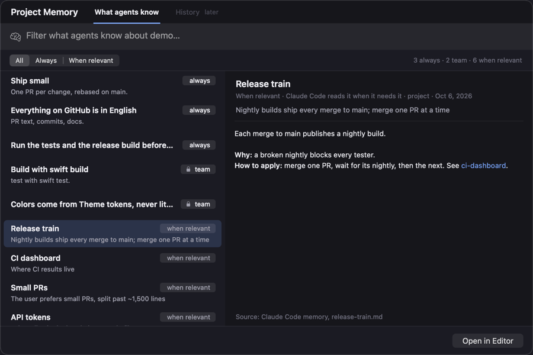

# Project Memory

Status: decided with the user on 2026-10-05. The read-only panel ships first;
switching, editing and adding come in a second pull request (section 4). The
History tab, greyed for now, is designed separately.

Agents learn about a repository from several files: the Nirux project brief,
the repository's `CLAUDE.md` and `AGENTS.md`, and the auto-memory Claude Code
keeps for itself under `~/.claude`. **Project Memory…** shows all of it as one
list, **What agents know**, whatever file holds an item.

## 1. Opening it

- **⌘P › Project Memory…**: the active workspace's repository.
- **The project menu › Project Memory…**: the repository of that project's
  active workspace, else of its first workspace.

The workspace's own folder decides, not where its focused terminal has
`cd`'d. The panel reads the files each time it opens, off the main thread. It
never writes: **Open in Editor** (Return, or a double click) opens the
selected item's file, at its line, in the editor of that workspace, brought
forward. The editor's own save and disk-conflict rules apply.

## 2. The list

Each item has a scope, in a chip:

- **Always**: a rule of the [project brief](projects.md#4-brief). Every
  Claude and Codex session Nirux starts in the project gets it, in every
  worktree.
- **Team** (locked): a rule of the repository's `CLAUDE.md`, `.claude/CLAUDE.md`
  or `AGENTS.md`, at its checkout's top. It changes there, in a commit.
- **When relevant**: a memory of Claude Code's auto-memory (section 3), one
  file each, which a session reads when it needs it. A `MEMORY.md` line whose
  file is gone shows last, in red.

A file's rules are its top-level bullets, their indented lines with them, and
its paragraphs. Headings, blank lines, a frontmatter and `<!-- -->` comments
aren't rules; a fenced code block stays whole. A rule's title is its bold
lead, else its first sentence or clause.

- **The filters**: words (all of them, anywhere in the item, case and accents
  ignored) and a scope: All, Always (the team's rules too: they apply
  always), When relevant.
- **The preview**: the title; the scope and what it means; for a memory, its
  type, date (`metadata.modified`, else the file's), description, and whether
  `MEMORY.md` lists it or lists it past what Claude Code reads; then the
  text. `**bold**` and `` `code` `` show as such; a `[[name]]` link to a
  memory selects it, clearing the filters that hide it; a link to no memory
  stays grey. At the bottom, in small, the file it comes from.
- **A notice** above the list when Claude Code doesn't use its memory
  (section 3), or when a setting moved it.

## 3. Where Claude Code keeps its memory

Claude Code's documentation doesn't give these rules; they come from its code
(version 2.1.289), and `ProjectMemory+Location.swift` follows them:

- **The folder** is `<config>/projects/<encoded root>/memory/`. `<config>` is
  `CLAUDE_CONFIG_DIR`, else `~/.claude`. In the root's path every UTF-16 unit
  but an ASCII letter or digit becomes `-`; past 200 characters, the first 200
  and a hash of the whole path.
- **The root** is the repository's main checkout. From the launch folder,
  Claude Code finds the nearest `.git`; for a linked worktree, it follows its
  `gitdir` and `commondir`, once the worktree's git folder points back at it.
  No git process runs. So every worktree and every subfolder of a repository
  shares one memory, while transcripts stay per worktree. Outside a
  repository, the launch folder is the root.
- **`MEMORY.md`** indexes the memories, one `- [Title](file.md) — hook` line
  each. Sessions read it at their start, trimmed, up to line 200 and 25,000
  characters; Nirux leaves its comments out.
- **`autoMemoryDirectory`**, in the first settings scope that sets it
  (managed, then `.claude/settings.local.json`, `.claude/settings.json`,
  `~/.claude/settings.json`), moves every repository's memory to that folder.
  A value Claude Code refuses (relative, `~/` itself, `~/..`, a network
  volume) leaves the default; it doesn't fall through to the next scope.
- **Off**: `CLAUDE_CODE_DISABLE_AUTO_MEMORY` (`1`, `true`, `yes`, `on`),
  `CLAUDE_CODE_SIMPLE` (`claude --bare`), `CLAUDE_CODE_SAFE_MODE`, or
  `autoMemoryEnabled: false` in the first scope that sets it. A false
  `CLAUDE_CODE_DISABLE_AUTO_MEMORY` (`0`, `false`…) turns it on whatever the
  settings say.

Nirux reads its own environment, not the one a terminal's shell builds from
the user's startup files: a variable exported in `~/.zshrc` doesn't show. Nor
does it see `claude --settings`, a session's own toggles, the server's feature
flags, or whether the repository's settings are trusted (Claude Code reads a
repository's settings only once its folder is trusted).

Codex reads the brief (as `developer_instructions`) and `AGENTS.md`, not
Claude Code's memory.

## 4. Next: writing (second pull request)

- **Switch Always / When relevant** on an item: it moves between the brief
  and Claude Code's memory. The destination is written first, then the source
  removed, so a failure never loses the item.
- **Edit in place**, and **+ Add** (When relevant by default: a title, its
  kebab-case file name shown, a description and the text).
- **Delete…**, after a confirmation: a memory's file goes to the Trash and
  its `MEMORY.md` line goes.
- **Safe writes.** Sessions write the memory folder at any time, with no lock
  shared with Nirux. Every write goes to a temporary file, then a rename that
  never replaces another file. Nirux re-reads `MEMORY.md` right before
  writing it and changes only its own line, never rewriting the index from an
  older copy, and never touches a file the user didn't act on.
